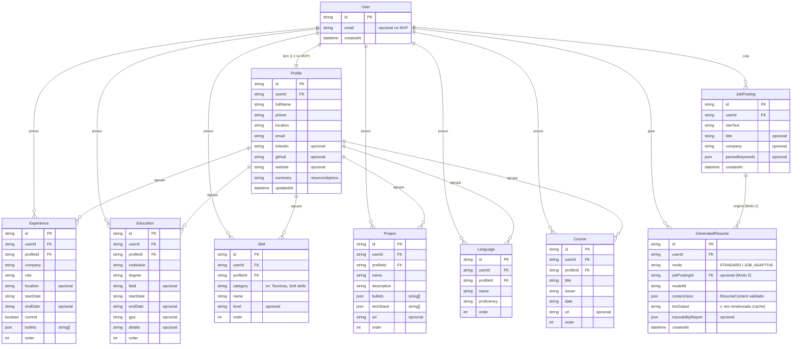

# Modelo de Dados (ERD) — CV-Adapter

Diagrama de entidade-relacionamento da base de dados. Toda entidade de domínio carrega
`userId` (FK para `User`) — garantia de migração para multiusuário sem retrabalho.
Versão Mermaid pura para o plugin do VS Code: `docs/erd.mmd`.

## Notas de modelagem

- **`userId` em tudo:** no MVP há um único `User` semeado (`LOCAL_USER_ID`); migrar para
  multiusuário não muda o schema, só a origem do id (seam `getCurrentUserId()`).
- **Campos JSON** (`bullets`, `techStack`, `parsedKeywords`, `contentJson`,
  `traceabilityReport`): mesmo formato em SQLite e Postgres.
- **`texOutput` cacheado:** rebaixar um currículo do histórico não refaz chamada ao LLM.
- **Datas como string:** currículos usam formatos livres ("Jan 2017", "Atual", "2024");
  validação fica na camada Zod, não no banco.
